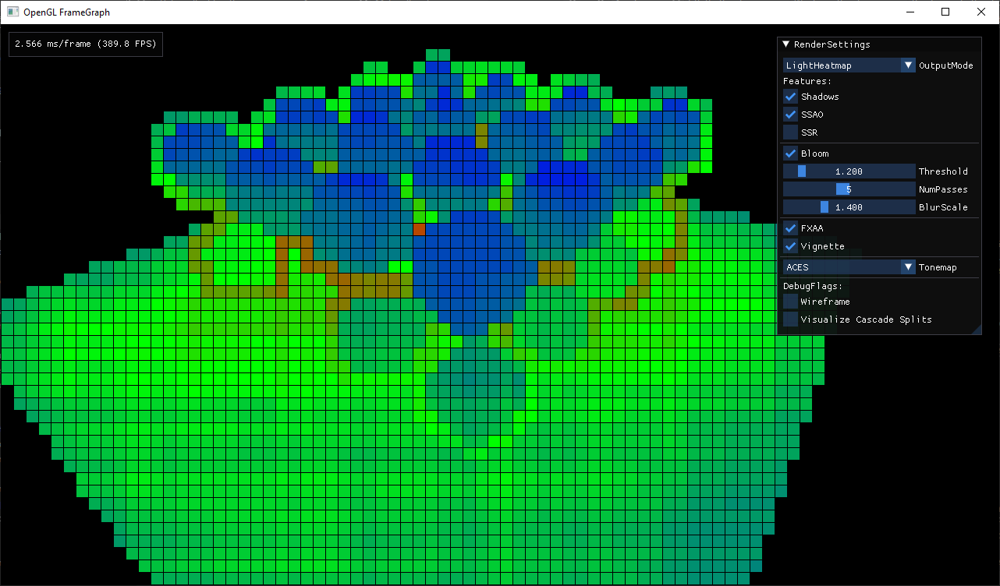
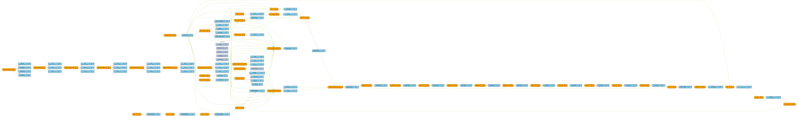

# FrameGraph Example

 



## Features

- [FrameGraph](https://github.com/skaarj1989/FrameGraph)
- PBR + IBL
- Tiled Deferred Rendering
- Weighted Blended Order Independent Transparency
- Normal/Parallax Mapping
- Cascaded ShadowMaps
- Skybox
- Screen Space Ambient Occlusion
- Screen Space Reflections
- Bloom
- FXAA
- Tonemapping
- Postprocessing effects
- Frustum Culling

## Building

Requires [CMake 3.20](https://cmake.org/) and [vcpkg](https://github.com/microsoft/vcpkg)

```bash
> git clone --recurse-submodules https://github.com/skaarj1989/FrameGraph-Example.git
> cmake -S . -B build
```

### vcpkg quickstart

https://github.com/microsoft/vcpkg#getting-started

```bash
> git clone https://github.com/microsoft/vcpkg
> ./vcpkg/bootstrap-vcpkg.bat
```

Add the following environment variables

```bash
VCPKG_ROOT=path_to_vcpkg
VCPKG_DEFAULT_TRIPLET=x64-windows
```

Install required dependencies

```bash
> vcpkg install spdlog glm glfw3 stb nlohmann-json imgui
```

## Dependencies

- [FrameGraph](https://github.com/skaarj1989/FrameGraph)
- [spdlog](https://github.com/gabime/spdlog)
- [glm](https://github.com/g-truc/glm)
- OpenGL 4.6
- [glad](https://glad.dav1d.de/)
- [GLFW](https://github.com/glfw/glfw)
- [stb_image](https://github.com/nothings/stb)
- [ImGui](https://github.com/ocornut/imgui)
- [Tracy Profiler](https://github.com/wolfpld/tracy)
- [nlohmann-json](https://github.com/nlohmann/json)

## Acknowledgments

- [Forward vs Deferred vs Forward+ Rendering with DirectX 11](https://www.3dgep.com/forward-plus/)

## License

[MIT](LICENSE)
